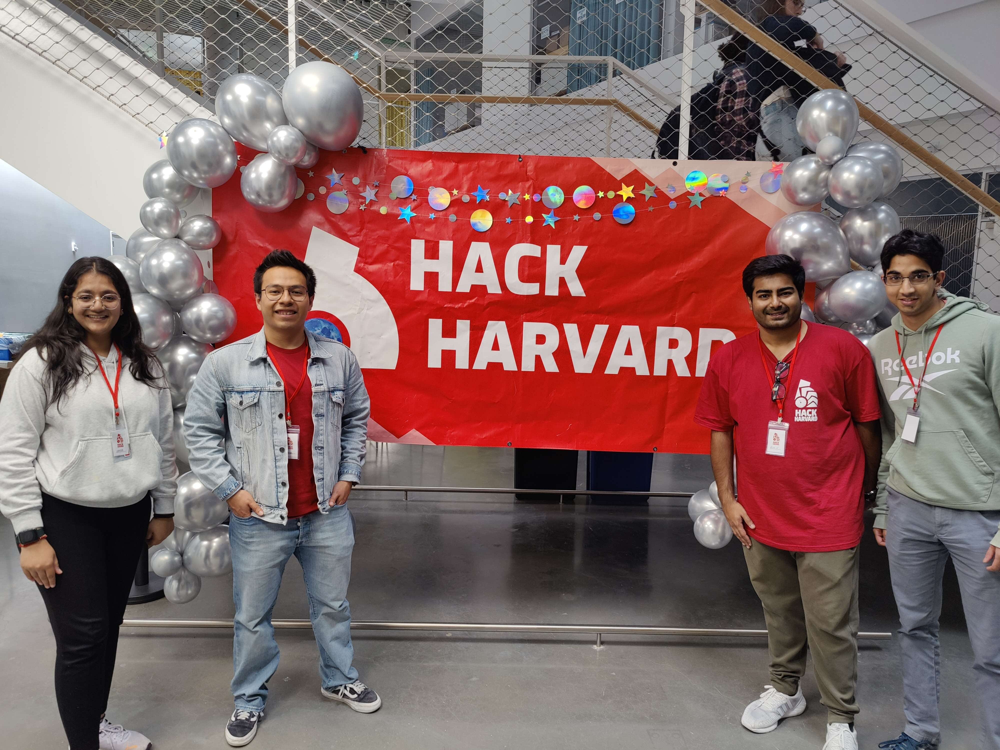

# 🚀 Hack Harvard 2023:  Hack for the Future 🚀

  

# 🌾 Crop Planning Tool 🌾

The alarming surge in suicide rates among farmers in developing countries begs the question: What is driving these individuals to such a desperate point? Their relentless pursuit of higher yields has led many to employ excessive quantities of fertilizers and pesticides, with the hope of boosting their crop output. However, instead of reaping financial benefits, these practices often result in mounting debts and profound despair, ultimately pushing some farmers to take their own lives. 

What's more, the overdose of fertilizers not only contributes to soil pollution but also leads to diminishing yields over time, creating a detrimental feedback loop. This perilous combination of financial strain, environmental degradation, and declining agricultural productivity underscores the urgent need for comprehensive solutions to safeguard farmer well-being, promote environmental sustainability, and ensure the long-term success of agriculture in these regions.

# 🌟 What it does 🌟

At CropNsoil, our cutting-edge program harnesses crucial data, such as farm location, size, soil nitrogen levels, and pH, to meticulously craft the **optimal intercropping strategy** for your fields. 
We utilize advanced modeling techniques to determine the most harmonious crop combinations and their precise spatial arrangement. Our primary goal is to enhance your revenue, all while promoting sustainability and safeguarding the Earth's precious soil.

By intelligently pairing crops that complement each other's growth, we create a synergy that significantly boosts overall efficiency by reducing the need of excess fertilizers and pesticides. This increases your income, reduces the risk factor associated with failure of one crop, but also plays a pivotal role in protecting our environment. 

Furthermore, our custom intercropping patterns are tailored to harness the unique attributes of your specific location. This ensures that your agricultural practices are aligned with the environmental conditions of your farm. By making the most of what your land has to offer, we contribute to a sustainable farming future that safeguards our soil and protects our planet.

# 🫂 The Team 🫂

- [Adrián Landaverde Nava](https://www.linkedin.com/in/adrian-landaverde-nava/)
- [Alim Vasaya](https://www.linkedin.com/in/alimvasaya/)
- [Kanika Gupta](https://www.linkedin.com/in/kanikagupta16/)
- [Surya Patil](https://www.linkedin.com/in/surya-patil-01a3651a5/)

  

# 🧠 What we learned 🧠

Learned about soils and the necessities of cropping system. 
Creating frontend models several tools.

# 💥 Challenges we ran into 💥

Understanding the problem and the idea. Trying to minimize the scope and build this project in the given timeframe. 
Calling the machine learning model into the frontend.

# 🔮 What's Next 🔮

In the future we see the data collection that is done currently by asking the farmers to be done by the automated drones using sensors (winner HackHarvard 2022).

