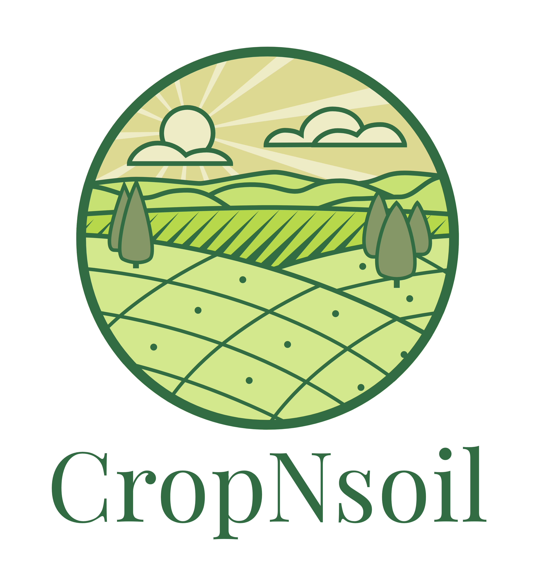

# 🚀 Hack Harvard 2023:  Hack for the Future 🚀

  

# 🌾 Crop Planning Tool 🌾

# 🌟 What it does 🌟

-
-
-
-

# 🫂 The Team 🫂

- Adrián Landaverde Nava
-
-
-

# 🧠 What we learned 🧠

# 💥 Challenges we ran into 💥

-
-
-
-

